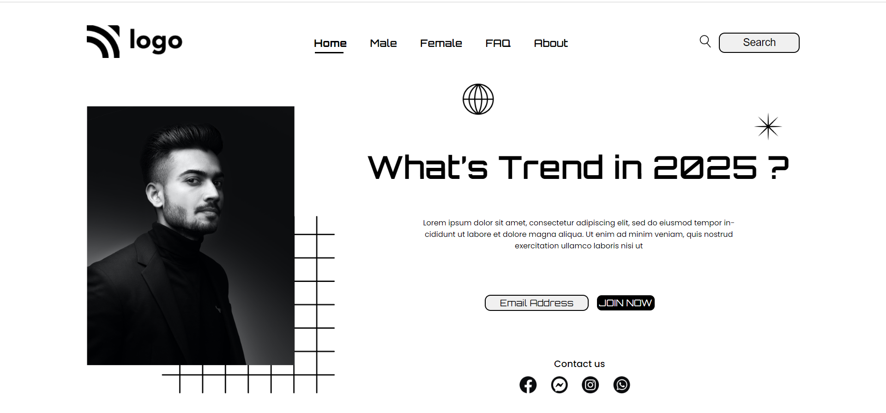

# **Street Style Landibg Page**

By Subrata

Here's the Live Deployed Website : [here](https://www.youtube.com/ )

## What I learned from this Project?

- This project was a very good learning experience for me.
- I learned how to use HTML and CSS to create a beutiful website.
- I learned about the ways of positioning elements in the HTML and CSS.
- I learned about z indexing to stack elements on top of each other.

#### How the website looks like
---

***

